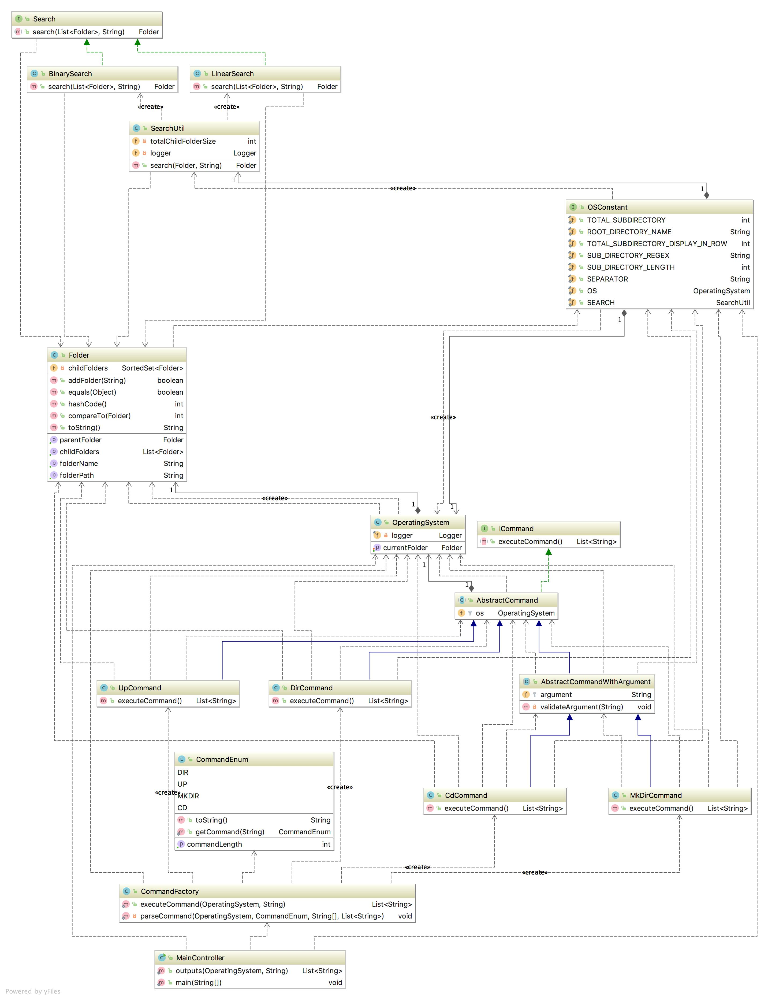

Basic Requirement
============================
Create a Virtual File System which will support these following set of command.
###### * `dir` - Display the content of the current folder. 
###### * `cd`- Change the current folder to any specified child folder passed as argument
###### * `mkdir` - Create a child folder
###### * `up`- Move to parent folder

 Class Diagram
============================

Assumption
=====================
### * Program will take one input
##### 1. Input file name from where program will read all the commands 

### * In order to build and execute this program, following software are required.
##### 1. JDK 1.8
##### 2. Maven 3.5.x

Building and Execution
=======================
##### 1. Check out the Git repository
    git clone https://github.com/deyindra/subdirectories.git
##### 2. Run following maven command to build the project
    mvn clean install
##### 3. Go to the target folder after build is finished and un-tar "subdirectories-bin.tar"
        cd target
        mkdir releases
        cd releases
        tar -xvf ../subdirectories-bin.tar
##### 4. Execute the following command which will display all the output command
    java -jar subdirectories-1.0-SNAPSHOT.jar <<input file name>>
##### 5. Please refer  for sample input file containing command

Current Limitation and Enhancement
===================================
### 1. Currently only showing the content of the current folder. However it can be improve to display the content of the sub sub folders by doing DFS search.
### 2. Program is single threaded only. 
### 3. Currently only There is no concept of USER home directory
### 4. Currently there is no concept of file which can be implemented as enhancement.                

    
    

 